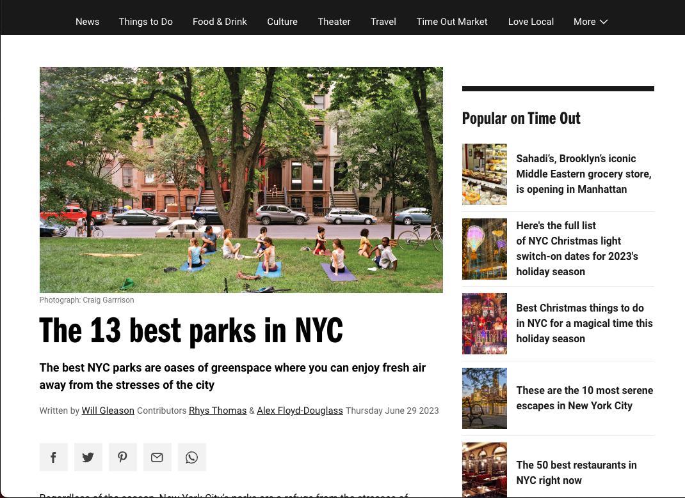
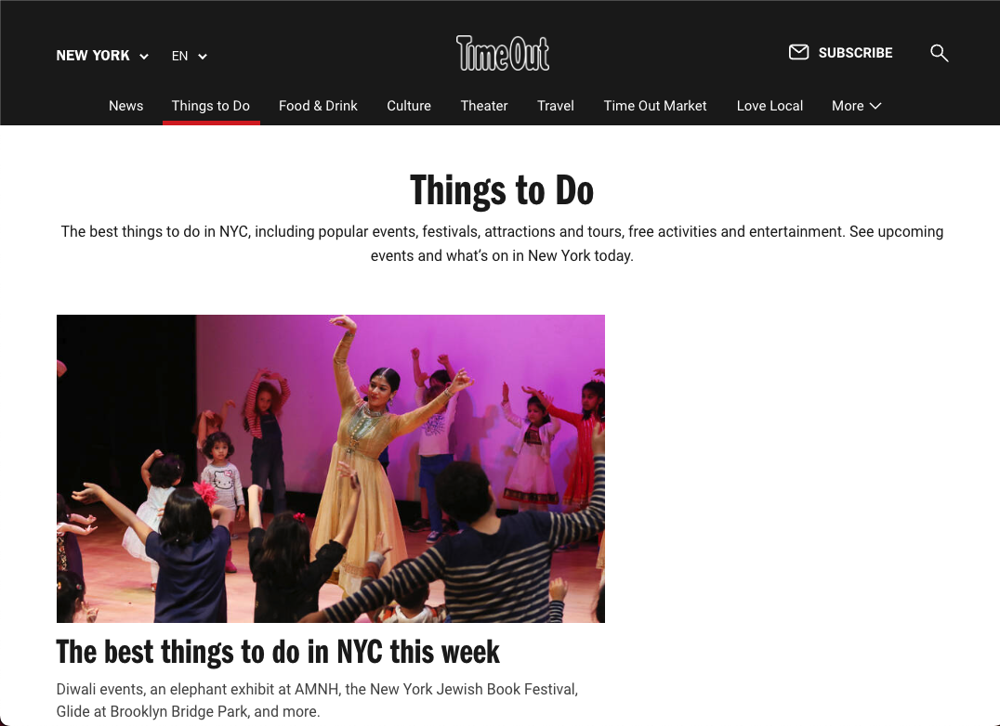
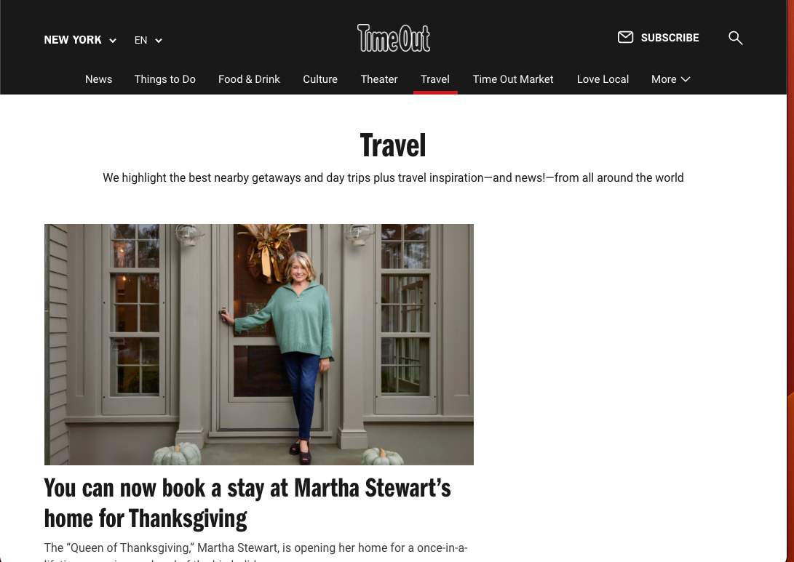

# Capstone 2: Enjoy the outdoors

Description:
- HTML, CSS and JS project
- It involves finding national parks using dropdowns
- There are three pages, home, search by location/type

## Pages

### Home

This is the landing page for our website and it includes navigation and highlights things people can to enjoy the great outdoors.



## Things to do


## Travel


## Interesting Code Snippet

```
    const locations = [
        { name: "Rocky Mountain", type: "mountain", difficulty: "hard" },
        { name: "Yosemite", type: "park", size: "large" },
        { name: "Everest", type: "mountain", difficulty: "extreme" },
        { name: "Zion", type: "park", size: "medium" }
    ];

    const filteredMountains = filterLocations(locations, { type: "mountain" });
    console.log(filteredMountains);

    const difficultMountains = filterLocations(locations, { type: "mountain", difficulty: "hard" });
    console.log(difficultMountains);
```